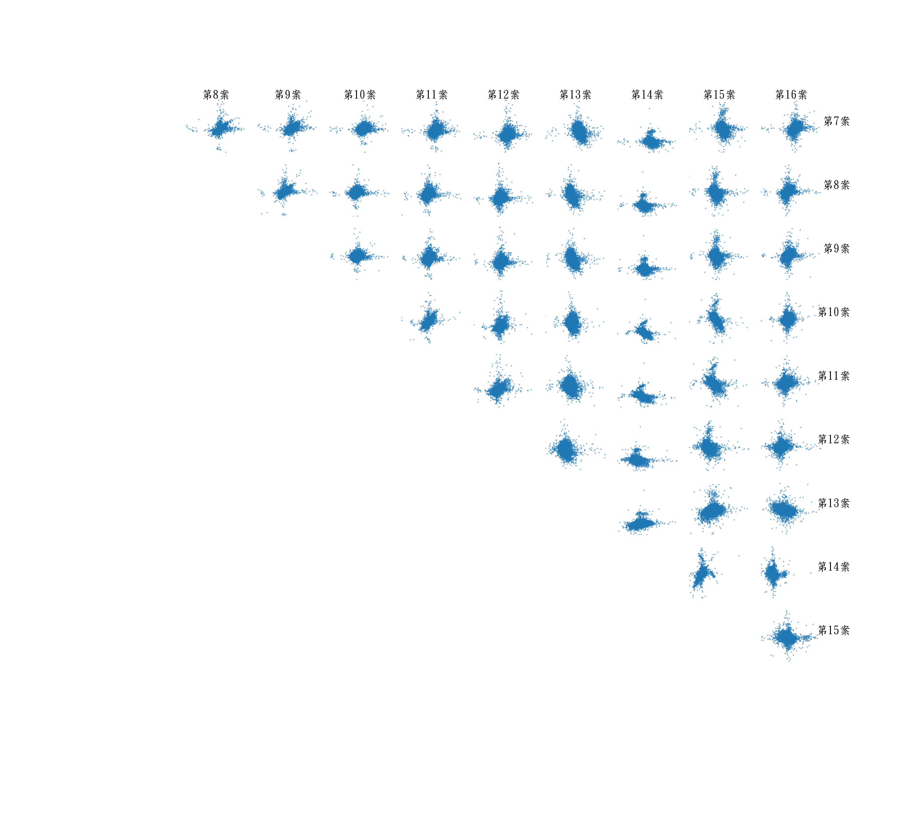
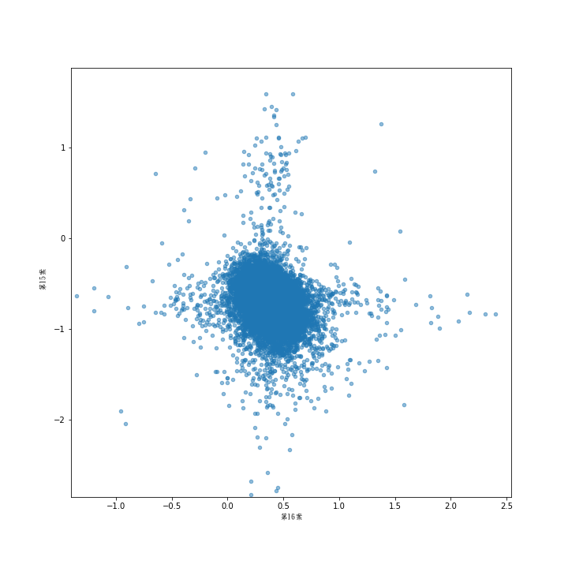
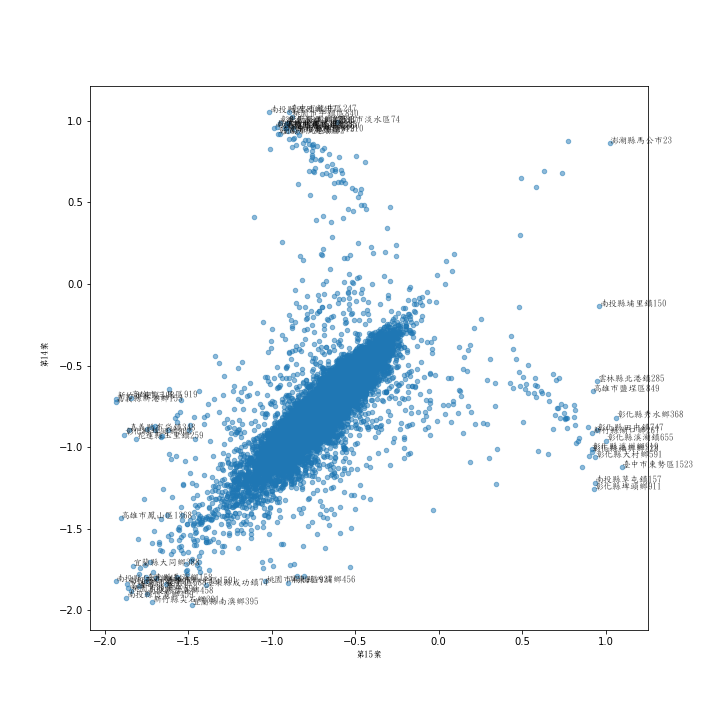
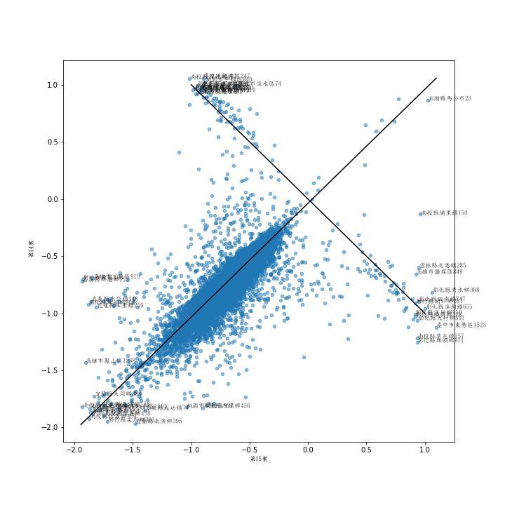
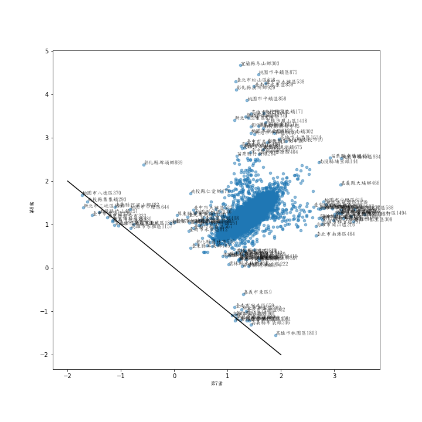
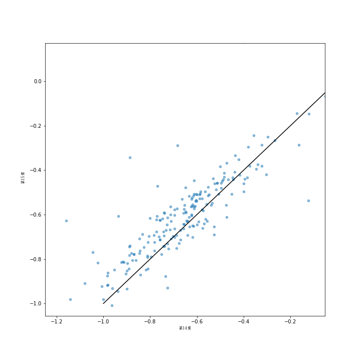

# 簡述

剛剛看到yutin1987上傳的2018台灣公投的[所有開票所的結果](https://github.com/g0v/referendum_report/tree/master/results2)，出於對資料的手癢，就立即下載下來跑了分析。不跑不知道，一跑嚇一跳。通過初步的描述分析就可以發現，中選會公佈的有些開票所的結果出現了明顯不合理的數據！

廢話不多說，直接上結果。

首先，這是所有公投案之間的散點圖。可以看到，與鄉鎮層級的結果不同的是，在每張圖上，垂直和水平方向都出現了不少的觀測值，這是不合常理的。

我們隨便看看其中的一張。

我一開始以為是極端值特有的屬性，但是看到下面這張圖，就發現有些開票結果是明顯有問題的。這是第14案vs第15案的散點圖。我們知道這兩案都是平權方提出的，兩案的開票結果應該是高度正相關的。在絕大多數的開票所，結果也確實是高度正相關。但是，散點圖也顯示，有不少的奇怪的觀測值出現在圖的正上方和正右方。若仔細看這些極端值的話，他們在兩個公投案的結果上是負相關的！

畫上兩條線後，一目了然！兩條斜度是1和-1的斜線可以完美地貫穿所有的觀測值。+1斜線附近的觀測值是正常的。-1斜線附近的觀測值是不正常的，在這些開票，有一案的公投結果應該是報反了！

我們可以直接在中選會的網站上找到這些開票所的結果。例如，以南投縣中寮鄉0373開票所為例。下面是兩案結果的鏈接：

http://referendum.2018.nat.gov.tw/pc/zh_TW/08/10008000800000373.html

http://referendum.2018.nat.gov.tw/pc/zh_TW/09/10008000800000373.html

我們可以看到，14案和15案的結果是相反的。隨便再舉一例：高雄市三民區0943開票所。

http://referendum.2018.nat.gov.tw/pc/zh_TW/08/64000000500000943.html

http://referendum.2018.nat.gov.tw/pc/zh_TW/09/64000000500000943.html

這些結果都是明顯不合理的。
  
 
 結論：中選會公佈的公投案結果有重大瑕疵。投票中少數人因為看不懂公投題目投反了是有可能的，但是一整個投票所所有人都投反了，這是難以用常理解釋的。雖然出問題的投票所應該不是很多，當不會影響總體的結果。經過我進一步的檢驗（見更新3），應該可以基本斷定，是中選會的系統內出現了故障，造成了全國接近1%（見更新2）的投票所的結果報反，這應該是個不小的事故。
 

# 疑問 1

不合理的結果並不僅僅是出現在第14、15案，下面是第7、8案的散點圖。

為什麼所有的極端值都出現在一條水平和一條垂直線上？左邊的極端值可以用一條-1斜線完美貫穿，也就是說那些投票所的結果應該也是有一案報反了，但是我無法解釋上面和下面的極端值。

報反的案例：桃園市八德區370。

http://referendum.2018.nat.gov.tw/pc/zh_TW/01/68000000800000370.html

http://referendum.2018.nat.gov.tw/pc/zh_TW/02/68000000800000370.html

# 更新 1

有幾個問題可以立即回答。首先，中選會公佈的全國總的開票數結果是否等於各投開票結果之和呢？

答案：是！以下是各投開票所結果之和，與中選會公佈的[總開票結果](http://referendum.2018.nat.gov.tw/pc/zh_TW/00/00000000000000000.html)完全一致。也就是說，不僅僅是網站報錯了，中選會的原始數據就是錯的！

<table border="1" class="dataframe">
  <thead>
    <tr style="text-align: right;">
      <th></th>
      <th>同意票數</th>
      <th>不同意票數</th>
    </tr>
    <tr>
      <th>案件</th>
      <th></th>
      <th></th>
    </tr>
  </thead>
  <tbody>
    <tr>
      <th>第10案</th>
      <td>7658008</td>
      <td>2907429</td>
    </tr>
    <tr>
      <th>第11案</th>
      <td>7083379</td>
      <td>3419624</td>
    </tr>
    <tr>
      <th>第12案</th>
      <td>6401748</td>
      <td>4072471</td>
    </tr>
    <tr>
      <th>第13案</th>
      <td>4763086</td>
      <td>5774556</td>
    </tr>
    <tr>
      <th>第14案</th>
      <td>3382286</td>
      <td>6949697</td>
    </tr>
    <tr>
      <th>第15案</th>
      <td>3507665</td>
      <td>6805171</td>
    </tr>
    <tr>
      <th>第16案</th>
      <td>5895560</td>
      <td>4014215</td>
    </tr>
    <tr>
      <th>第7案</th>
      <td>7955753</td>
      <td>2109157</td>
    </tr>
    <tr>
      <th>第8案</th>
      <td>7599267</td>
      <td>2346316</td>
    </tr>
    <tr>
      <th>第9案</th>
      <td>7791856</td>
      <td>2231425</td>
    </tr>
  </tbody>
</table>

# 更新 2

那麼，結果報反的投票所有多少呢？如果把-1斜線附近的投票所都抓出來的話（詳情見代碼），以下為統計結果。可以看到，絕大多數的報反的案例出現在第14、15案，有141個，佔全國投票所數量的0.89%。這141個投票所的投票數為93306，佔全國總投票數的0.9%，對總的投票結果的影響應該不大。

<table border="1" class="dataframe">
  <thead>
    <tr style="text-align: right;">
      <th></th>
      <th>第7、8案</th>
      <th>第8、9案</th>
      <th>第10、11案</th>
      <th>第14、15案</th>
      <th>合集</th>
    </tr>
  </thead>
  <tbody>
    <tr>
      <th>不合理結果數量</th>
      <td>23</td>
      <td>19</td>
      <td>12</td>
      <td>141</td>
      <td>184</td>
    </tr>
  </tbody>
</table>

[這裡](dubious_cases.csv)是所有有疑問的結果。

# 更新3

雖然我很難想出有什麼正常的原因讓一個投票所所有的人在14、15案上面都投反，但還是不能排除我的想像力有限。為了確保我的結論是正確的，我又做了進一步的檢驗。思路是這樣的，有很多投票所的地址是相同的，如果一天投票所的結果是反的，那麼同地址的其他投票所的結果也是反的嗎？我找出了所有14、15案投反的投票所的地址，並找出了和這些投票所地址相同的其他投票所，以下是其他投票所結果的散點圖。這些結果大部分都在+1斜線附近，也就是說，這些結果都是正常的。

隨便舉個例子，嘉義市東區新店里林森東路346號有兩個投票所，分別在嘉義市東區林森國小一年甲班教室和一年乙班教室，選民都來自同一個里，只是街牌號不同。我們可以看到，19號開票所的兩案結果是一致的，20號開票所的結果是相反的。所以，應該不是有什麼神奇的里長可以有扭轉乾坤之力。

<table border="1" class="dataframe">
  <thead>
    <tr style="text-align: right;">
      <th></th>
      <th>案件</th>
      <th>縣市</th>
      <th>鄉鎮市區</th>
      <th>里</th>
      <th>鄰</th>
      <th>編號</th>
      <th>投開票所</th>
      <th>地址</th>
      <th>同意票數</th>
      <th>不同意票數</th>
      <th>有效票數</th>
      <th>無效票數</th>
      <th>投票數</th>
      <th>已領未投票數</th>
      <th>發出票數</th>
      <th>用於票數</th>
      <th>投票權人數</th>
      <th>投票率(%)</th>
      <th>有效同意票數對投票權人數百分比(%)</th>
      <th>有效不同意票數對投票權人數百分比(%)</th>
      <th>有效同意與不同意票數對投票權人數百分比差值</th>
    </tr>
    <tr>
      <th>地址</th>
      <th></th>
      <th></th>
      <th></th>
      <th></th>
      <th></th>
      <th></th>
      <th></th>
      <th></th>
      <th></th>
      <th></th>
      <th></th>
      <th></th>
      <th></th>
      <th></th>
      <th></th>
      <th></th>
      <th></th>
      <th></th>
      <th></th>
      <th></th>
      <th></th>
    </tr>
  </thead>
  <tbody>
    <tr>
      <th>嘉義市東區新店里林森東路346號</th>
      <td>第14案</td>
      <td>嘉義市</td>
      <td>東區</td>
      <td>新店里</td>
      <td>2,6-9,15,18,19</td>
      <td>19</td>
      <td>嘉義市東區林森國小(一年甲班教室)</td>
      <td>嘉義市東區新店里林森東路346號</td>
      <td>296</td>
      <td>547</td>
      <td>843</td>
      <td>48</td>
      <td>891</td>
      <td>0</td>
      <td>891</td>
      <td>667</td>
      <td>1558</td>
      <td>57.19%</td>
      <td>19.00%</td>
      <td>35.11%</td>
      <td>-16.11</td>
    </tr>
    <tr>
      <th>嘉義市東區新店里林森東路346號</th>
      <td>第14案</td>
      <td>嘉義市</td>
      <td>東區</td>
      <td>新店里</td>
      <td>10-14</td>
      <td>20</td>
      <td>嘉義市東區林森國小(一年乙班教室)</td>
      <td>嘉義市東區新店里林森東路346號</td>
      <td>181</td>
      <td>411</td>
      <td>592</td>
      <td>30</td>
      <td>622</td>
      <td>1</td>
      <td>623</td>
      <td>439</td>
      <td>1062</td>
      <td>58.57%</td>
      <td>17.04%</td>
      <td>38.70%</td>
      <td>-21.66</td>
    </tr>
    <tr>
      <th>嘉義市東區新店里林森東路346號</th>
      <td>第15案</td>
      <td>嘉義市</td>
      <td>東區</td>
      <td>新店里</td>
      <td>2,6-9,15,18,19</td>
      <td>19</td>
      <td>嘉義市東區林森國小(一年甲班教室)</td>
      <td>嘉義市東區新店里林森東路346號</td>
      <td>316</td>
      <td>528</td>
      <td>844</td>
      <td>46</td>
      <td>890</td>
      <td>0</td>
      <td>890</td>
      <td>668</td>
      <td>1558</td>
      <td>57.12%</td>
      <td>20.28%</td>
      <td>33.89%</td>
      <td>-13.61</td>
    </tr>
    <tr>
      <th>嘉義市東區新店里林森東路346號</th>
      <td>第15案</td>
      <td>嘉義市</td>
      <td>東區</td>
      <td>新店里</td>
      <td>10-14</td>
      <td>20</td>
      <td>嘉義市東區林森國小(一年乙班教室)</td>
      <td>嘉義市東區新店里林森東路346號</td>
      <td>406</td>
      <td>188</td>
      <td>594</td>
      <td>30</td>
      <td>624</td>
      <td>0</td>
      <td>624</td>
      <td>438</td>
      <td>1062</td>
      <td>58.76%</td>
      <td>38.23%</td>
      <td>17.70%</td>
      <td>20.53</td>
    </tr>
  </tbody>
</table>

再舉個例子：

<table border="1" class="dataframe">
  <thead>
    <tr style="text-align: right;">
      <th></th>
      <th>案件</th>
      <th>縣市</th>
      <th>鄉鎮市區</th>
      <th>里</th>
      <th>鄰</th>
      <th>編號</th>
      <th>投開票所</th>
      <th>地址</th>
      <th>同意票數</th>
      <th>不同意票數</th>
      <th>有效票數</th>
      <th>無效票數</th>
      <th>投票數</th>
      <th>已領未投票數</th>
      <th>發出票數</th>
      <th>用於票數</th>
      <th>投票權人數</th>
      <th>投票率(%)</th>
      <th>有效同意票數對投票權人數百分比(%)</th>
      <th>有效不同意票數對投票權人數百分比(%)</th>
      <th>有效同意與不同意票數對投票權人數百分比差值</th>
    </tr>
    <tr>
      <th>地址</th>
      <th></th>
      <th></th>
      <th></th>
      <th></th>
      <th></th>
      <th></th>
      <th></th>
      <th></th>
      <th></th>
      <th></th>
      <th></th>
      <th></th>
      <th></th>
      <th></th>
      <th></th>
      <th></th>
      <th></th>
      <th></th>
      <th></th>
      <th></th>
      <th></th>
    </tr>
  </thead>
  <tbody>
    <tr>
      <th>臺北市松山區敦化北路2號</th>
      <td>第14案</td>
      <td>臺北市</td>
      <td>松山區</td>
      <td>敦化里</td>
      <td>1-7,12-13</td>
      <td>629</td>
      <td>敦化國小1年1班</td>
      <td>臺北市松山區敦化北路2號</td>
      <td>345</td>
      <td>476</td>
      <td>821</td>
      <td>30</td>
      <td>851</td>
      <td>1</td>
      <td>852</td>
      <td>600</td>
      <td>1452</td>
      <td>58.61%</td>
      <td>23.76%</td>
      <td>32.78%</td>
      <td>-9.02</td>
    </tr>
    <tr>
      <th>臺北市松山區敦化北路2號</th>
      <td>第14案</td>
      <td>臺北市</td>
      <td>松山區</td>
      <td>敦化里</td>
      <td>8-10,20-24</td>
      <td>630</td>
      <td>敦化國小1年2班</td>
      <td>臺北市松山區敦化北路2號</td>
      <td>319</td>
      <td>486</td>
      <td>805</td>
      <td>38</td>
      <td>843</td>
      <td>7</td>
      <td>850</td>
      <td>632</td>
      <td>1482</td>
      <td>56.88%</td>
      <td>21.52%</td>
      <td>32.79%</td>
      <td>-11.27</td>
    </tr>
    <tr>
      <th>臺北市松山區敦化北路2號</th>
      <td>第14案</td>
      <td>臺北市</td>
      <td>松山區</td>
      <td>敦化里</td>
      <td>16,25-28,30</td>
      <td>631</td>
      <td>敦化國小1年3班</td>
      <td>臺北市松山區敦化北路2號</td>
      <td>321</td>
      <td>523</td>
      <td>844</td>
      <td>35</td>
      <td>879</td>
      <td>0</td>
      <td>879</td>
      <td>581</td>
      <td>1460</td>
      <td>60.21%</td>
      <td>21.99%</td>
      <td>35.82%</td>
      <td>-13.83</td>
    </tr>
    <tr>
      <th>臺北市松山區敦化北路2號</th>
      <td>第14案</td>
      <td>臺北市</td>
      <td>松山區</td>
      <td>敦化里</td>
      <td>11,14-15,17-19,29</td>
      <td>632</td>
      <td>敦化國小1年4班</td>
      <td>臺北市松山區敦化北路2號</td>
      <td>309</td>
      <td>459</td>
      <td>768</td>
      <td>41</td>
      <td>809</td>
      <td>0</td>
      <td>809</td>
      <td>589</td>
      <td>1398</td>
      <td>57.87%</td>
      <td>22.10%</td>
      <td>32.83%</td>
      <td>-10.73</td>
    </tr>
    <tr>
      <th>臺北市松山區敦化北路2號</th>
      <td>第15案</td>
      <td>臺北市</td>
      <td>松山區</td>
      <td>敦化里</td>
      <td>1-7,12-13</td>
      <td>629</td>
      <td>敦化國小1年1班</td>
      <td>臺北市松山區敦化北路2號</td>
      <td>349</td>
      <td>465</td>
      <td>814</td>
      <td>23</td>
      <td>837</td>
      <td>12</td>
      <td>849</td>
      <td>603</td>
      <td>1452</td>
      <td>57.64%</td>
      <td>24.04%</td>
      <td>32.02%</td>
      <td>-7.98</td>
    </tr>
    <tr>
      <th>臺北市松山區敦化北路2號</th>
      <td>第15案</td>
      <td>臺北市</td>
      <td>松山區</td>
      <td>敦化里</td>
      <td>8-10,20-24</td>
      <td>630</td>
      <td>敦化國小1年2班</td>
      <td>臺北市松山區敦化北路2號</td>
      <td>338</td>
      <td>481</td>
      <td>819</td>
      <td>29</td>
      <td>848</td>
      <td>0</td>
      <td>848</td>
      <td>634</td>
      <td>1482</td>
      <td>57.22%</td>
      <td>22.81%</td>
      <td>32.46%</td>
      <td>-9.65</td>
    </tr>
    <tr>
      <th>臺北市松山區敦化北路2號</th>
      <td>第15案</td>
      <td>臺北市</td>
      <td>松山區</td>
      <td>敦化里</td>
      <td>16,25-28,30</td>
      <td>631</td>
      <td>敦化國小1年3班</td>
      <td>臺北市松山區敦化北路2號</td>
      <td>329</td>
      <td>512</td>
      <td>841</td>
      <td>31</td>
      <td>872</td>
      <td>7</td>
      <td>879</td>
      <td>581</td>
      <td>1460</td>
      <td>59.73%</td>
      <td>22.53%</td>
      <td>35.07%</td>
      <td>-12.54</td>
    </tr>
    <tr>
      <th>臺北市松山區敦化北路2號</th>
      <td>第15案</td>
      <td>臺北市</td>
      <td>松山區</td>
      <td>敦化里</td>
      <td>11,14-15,17-19,29</td>
      <td>632</td>
      <td>敦化國小1年4班</td>
      <td>臺北市松山區敦化北路2號</td>
      <td>464</td>
      <td>297</td>
      <td>761</td>
      <td>48</td>
      <td>809</td>
      <td>0</td>
      <td>809</td>
      <td>589</td>
      <td>1398</td>
      <td>57.87%</td>
      <td>33.19%</td>
      <td>21.24%</td>
      <td>11.95</td>
    </tr>
  </tbody>
</table>